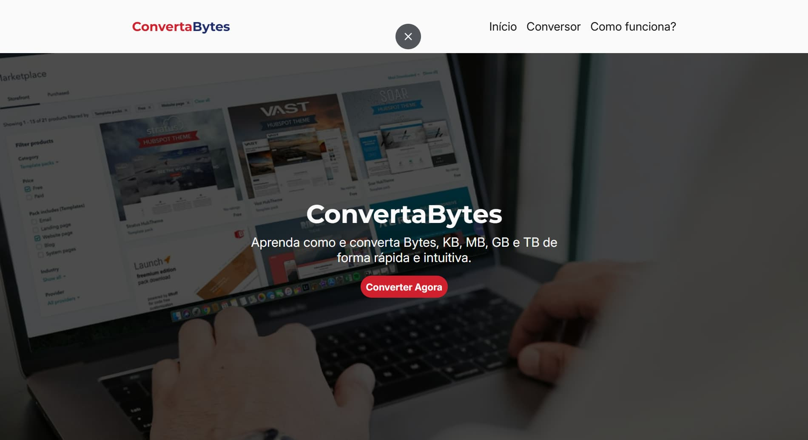

# 🔄 ConvertaBytes

Um conversor educacional de unidades de armazenamento baseado no sistema binário (Bytes, KB, MB, GB, TB e Bits). O site também explica como as unidades funcionam, por que usamos 1024 e como o cálculo é realizado.

## 🚀 Tecnologias Utilizadas

-  **HTML5** → Estrutura da página, semântica e acessibilidade.
-  **CSS3** → Estilização responsiva.
-  **JavaScript** → Lógica do conversor e interações do site.

## 🖼️ Demonstração

## 🔗 Link para o Deploy

[Acesse o projeto na Vercel](https://converta-bytes.vercel.app/)
